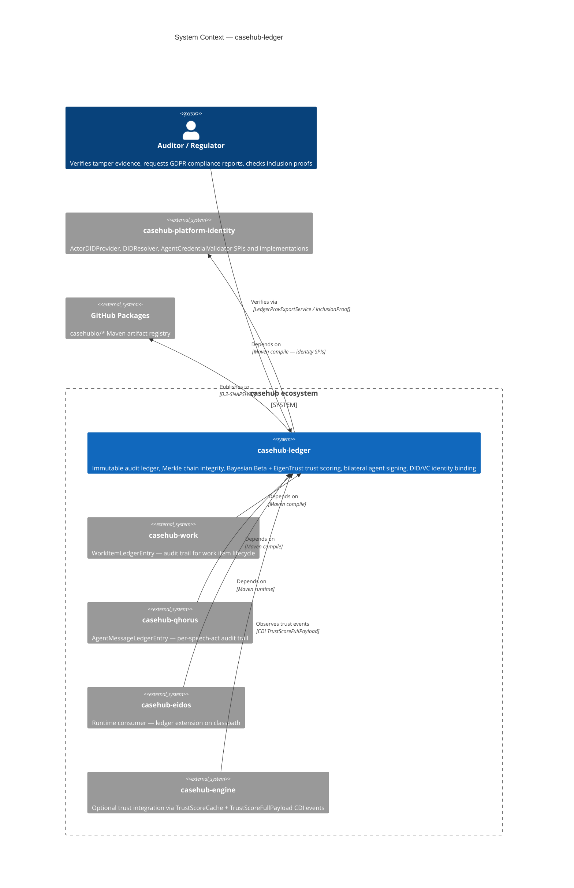
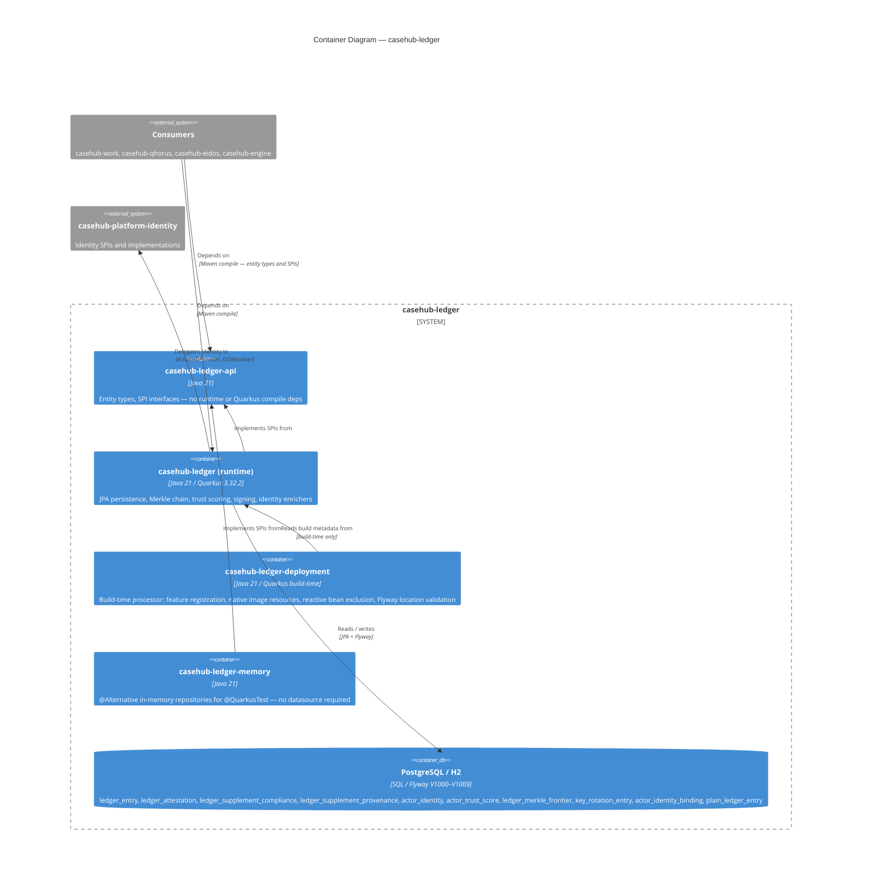

# casehub-ledger — ARC42STORIES.MD

**Spec:** Arc42Stories v0.1
**Profile:** CaseHub — Foundation tier
**Profile ref:** `../parent/docs/arc42stories-casehub-profile.md` · fallback: `https://raw.githubusercontent.com/casehubio/parent/main/docs/arc42stories-casehub-profile.md`
**Build position:** Early foundation — no casehubio dependencies. Must publish before qhorus, eidos, engine, and all application-tier apps.
**Consumed by:** casehub-qhorus (AgentMessageLedgerEntry), casehub-eidos (runtime), casehub-engine (optional ledger integration), all application-tier harness apps
**Depends on:** None — zero casehubio dependencies.

---

## §1 Introduction and Goals

### Description

`casehub-ledger` is the immutable tamper-evident audit and trust scoring layer for AI agent systems. It provides a Merkle-chained ledger of all case events and agent decisions; bilateral Ed25519 signing for per-entry agent accountability; W3C DID/VC cryptographic identity binding; Bayesian Beta + EigenTrust reputation scoring from outcome attestations; and GDPR-compliant supplements for right-to-erasure and decision context archiving.

Core capabilities:
- `LedgerEntry` — abstract base entity (JPA JOINED inheritance); append-only, hash-chained; domain subclasses join on `id`
- `LedgerAttestation` — peer attestation with verdict, confidence score, and `capabilityTag`
- `LedgerMerkleFrontier` — stored Merkle Mountain Range frontier; at most log₂(N) rows per subject
- `AgentSigner` SPI / `AgentSignatureEnricher` — bilateral Ed25519 signing per entry; algorithm-transparent; supports Vault Transit, Cloud KMS, HSMs
- `KeyRotationEntry` / `KeyRotationService` — agent signing key rotation with SUSPECT verdict for entries in compromised windows
- `ActorDIDEnricher` / `ActorIdentityValidationEnricher` — W3C DID/VC cryptographic identity binding; five-step validation pipeline; ENFORCE mode
- `TrustScoreJob` — nightly four-pass computation: capability → dimension → CAPABILITY_DIMENSION → global; Bayesian Beta + optional EigenTrust
- `OutcomeRecord` (api) / `DefaultOutcomeRecorder` (runtime) — structured write API for routing-only agent outcome entries
- `ComplianceSupplement` — GDPR Art.22 decision context metadata
- `ProvenanceSupplement` — source entity provenance + `agentConfigHash` for LLM config drift detection

Module structure: `api` (entity types, SPIs), `runtime` (Merkle chain, trust scoring, JPA persistence, signing, identity), `deployment` (Quarkus extension processor), `persistence-memory` (zero-datasource in-memory alternatives for `@QuarkusTest`).

### Stakeholders

| Stakeholder | Interest |
|---|---|
| Application-tier harness apps | Consume foundation primitives; define domain `LedgerEntry` subclasses |
| Platform team | Maintain correctness and backward compatibility |
| LLM sessions (Claude) | Navigate architecture and implement extensions confidently |
| Regulators / auditors | Verify tamper evidence, GDPR compliance, and agent decision audit trails |

### Quality Goals

| Goal | Scenario |
|---|---|
| Tamper-evidence | Every `LedgerEntry` is Merkle-chained; no entry can be modified without invalidating the frontier stored in `LedgerMerkleFrontier` |
| Agent accountability | Every entry carrying `agentPublicKey` is bilaterally signed; `actorId` is cryptographically bound to a W3C DID via `ActorIdentityValidationEnricher` |
| GDPR compliance | `ComplianceSupplement` enables per-entry GDPR Art.22 context archiving; `LedgerErasureService` erases personal data without breaking the Merkle chain |
| Trust accuracy | `TrustScoreJob` uses Bayesian Beta for direct attestation scoring and EigenTrust for transitive mesh trust |

---

## §2 Constraints

### Platform
Java 21 (on Java 26 JVM), Quarkus 3.32.2. Published to GitHub Packages as `io.casehub:casehub-ledger:0.2-SNAPSHOT`.

```bash
JAVA_HOME=$(/usr/libexec/java_home -v 26) mvn clean install
```

### Dependencies
Resolved from GitHub Packages: `https://maven.pkg.github.com/casehubio/*`. CI authentication via `GITHUB_TOKEN`. Depends on `casehub-platform-identity` for agent identity SPIs and implementations.

---

## §3 Context and Scope



**Boundary:** `casehub-ledger` owns entry persistence, Merkle chain mechanics, trust score computation, bilateral signing, DID/VC identity binding, and GDPR compliance supplements. Domain logic (business rules, application workflows, domain-specific entry types) belongs in consumer repos.

**Domain subclass consumers:**

| Consumer | Subclass | Subject maps to |
|---|---|---|
| `casehub-work` | `WorkItemLedgerEntry` | WorkItem UUID |
| `casehub-qhorus` | `AgentMessageLedgerEntry` | Channel UUID |

**Identity infrastructure:** SPIs and implementations for `ActorDIDProvider`, `DIDResolver`, `AgentCredentialValidator` live in `casehub-platform-identity`. `casehub-ledger` provides the enricher pipeline that wires identity into the write path.

See `../parent/docs/PLATFORM.md` Capability Ownership table for the full boundary map.

---

## §4 Solution Strategy

### Architectural Patterns

| Pattern | Applied in |
|---|---|
| JPA JOINED inheritance | `LedgerEntry` abstract base → domain subclasses; base table + subclass join tables |
| CDI SPI pipeline | `LedgerEntryEnricher`, `AgentSigner`, `GlobalScoreStrategy`, `DecayFunction`, `TrustImportService`, `LedgerReconciliationSource` |
| `@DefaultBean` / `@Alternative` displacement | All SPIs ship `@DefaultBean` no-ops; consumers displace via `@Alternative @Priority(1)` |
| Merkle Mountain Range | `LedgerMerkleFrontier` — at most log₂(N) rows per subject; RFC 9162 domain-separated leaf hashes |
| Algorithm-transparent signing | `AgentSigner.sign()` returns `AgentSignature`; enricher does not know the algorithm |
| CDI event dispatch | `TrustScoreRoutingPublisher`, `AgentKeyRotatedEvent`, `AgentSignatureSuspectEvent`, `LedgerGapDetected` |
| Reactive tier separation | Blocking-tier beans carry zero reactive imports; reactive beans excluded via `ExcludedTypeBuildItem` in `LedgerProcessor`; validated by `BlockingTierPurityTest` (reflection) and `BlockingReactiveParityTest` (ArchUnit); controlled by `LedgerBuildTimeConfig.reactive.enabled` |
| Test isolation via module | `persistence-memory` provides `@Alternative @Priority(1)` in-memory implementations; no datasource required |

### Module Responsibilities

| Module | Responsibility | Key constraint |
|---|---|---|
| `api` | Shared types, entity model, SPI interfaces | No runtime or Quarkus compile deps |
| `runtime` | JPA persistence, Merkle chain, trust scoring, signing, identity enrichers | Never binds to a named datasource; all SPIs have `@DefaultBean` no-ops |
| `deployment` | Build-time processor; feature registration, reactive bean exclusion, Flyway location validation, native image resources | Build-time only |
| `persistence-memory` | In-memory `@Alternative` implementations for all repositories | `@IfBuildProperty` gates reactive variants |

### Layer Taxonomy

Foundation tier — self-defined layers (no harness integration sequence):

| Layer | What it provides |
|---|---|
| Audit Primitives | `LedgerEntry` JOINED inheritance, repositories, Flyway migrations, supplements |
| Tamper Evidence | Merkle Mountain Range, Ed25519 signed checkpoints, verification, bilateral signing |
| Trust Infrastructure | Bayesian Beta, EigenTrust, multi-dimensional scoring, `DecayFunction` SPI, `GlobalScoreStrategy` SPI, trust routing |
| Agent Identity | DID/VC pipeline, `ActorDIDProvider` SPI, enricher priority ordering, ENFORCE mode |
| Compliance Surface | GDPR supplements, retention job, W3C PROV-DM export, OTel trace auto-wiring |
| Outcome Recording | `OutcomeRecord`, `DefaultOutcomeRecorder`, `PlainLedgerEntry`, routing integration |

### Chapter Sequencing

- Ch1 before all: `LedgerEntry` base schema (V1000) must precede all consumer subclass tables and all capability schemas
- Ch2 before Ch3: supplement schema (V1002) must settle before Merkle canonical form is finalised; `causedByEntryId` and `traceId` in core before hash chain is built on top
- Ch3 before Ch10: Merkle frontier entity must exist before `LedgerMerklePublisher` can produce checkpoints
- Ch9 before Ch10, Ch11: signing and identity enrichers must be testable without a datasource before those enrichers are built
- Ch10 before Ch11: `ActorIdentityValidationEnricher` reads `agentPublicKey` set by `AgentSignatureEnricher`; enricher ordering requires signing to exist first
- Ch11 before Ch12: identity pipeline must exist in ledger before extraction to platform
- Ch8 before Ch13: trust routing infrastructure must exist before `OutcomeRecorder` integrates with it

---

## §5 Building Block View



### Module Structure

| Module | artifactId | Purpose |
|---|---|---|
| `api` | `casehub-ledger-api` | Entity types, SPIs, model records — no runtime or Quarkus compile deps |
| `runtime` | `casehub-ledger` | Full runtime: JPA persistence, Merkle, trust, signing, identity |
| `deployment` | `casehub-ledger-deployment` | Quarkus build-time processor |
| `persistence-memory` | `casehub-ledger-memory` | In-memory `@Alternative` implementations for `@QuarkusTest` |

### Runtime Component Groups

| Group | Package | Key classes |
|---|---|---|
| Model | `runtime.model` | `LedgerEntry`, `LedgerAttestation`, `ActorTrustScore`, `LedgerMerkleFrontier`, `KeyRotationEntry`, `ActorIdentityBindingEntry`, `PlainLedgerEntry`, supplement classes |
| Repositories | `runtime.repository` | `LedgerEntryRepository`, `ReactiveLedgerEntryRepository`, `ActorTrustScoreRepository`, `KeyRotationRepository`, `ActorIdentityBindingRepository` + JPA `@Alternative` impls + `@DefaultBean` no-op impls (`NoOpLedgerEntryRepository`, `NoOpActorIdentityBindingRepository`, `NoOpLedgerMerkleFrontierRepository`) |
| Enricher pipeline | `runtime.service` | `LedgerTraceListener`, `TraceIdEnricher`, `AgentSignatureEnricher`, `ActorDIDEnricher`, `ActorIdentityValidationEnricher` |
| Trust | `runtime.service` | `TrustScoreComputer`, `EigenTrustComputer`, `TrustScoreJob`, `TrustGateService`, `GlobalScoreStrategy` + impls, `DecayFunction` + impls, `AttestationAggregator`, `TrustScoreRoutingPublisher` |
| Signing | `runtime.service` | `AgentSigner` SPI, `ConfiguredAgentSigner`, `AgentSignatureEnricher`, `AgentCryptographicVerifier`, `AgentSignatureVerificationService`, `ReactiveAgentSignatureVerificationService` |
| Identity | `runtime.service.identity` | `ActorDIDEnricher`, `ActorIdentityValidationEnricher`, `IdentityCacheInvalidator`, `LedgerIdentityEnforcementListener`, `ActorIdentityBindingObserver` |
| Compliance | `runtime.service` | `LedgerRetentionJob`, `LedgerErasureService`, `LedgerProvExportService`, `LedgerProvSerializer`, `LedgerComplianceReportService` |
| Outcome | `runtime.service` | `DefaultOutcomeRecorder`, `OutcomeRecordSaveService` |
| Privacy | `runtime.privacy` | `ActorIdentityProvider` SPI, `InternalActorIdentityProvider`, `LedgerErasureService` |

### persistence-memory Components

| Class | Role |
|---|---|
| `InMemoryLedgerEntryRepository` | `@Alternative @Priority(1)`; runs enricher pipeline in `save()`; `allEntries()` for delegates |
| `InMemoryLedgerMerkleFrontierRepository` | `ConcurrentHashMap`-backed Merkle frontier |
| `InMemoryActorTrustScoreRepository` | Composite key: `actorId|scoreType|cap|dim` |
| `InMemoryKeyRotationRepository` | Reads via `blocking.allEntries()` |
| `InMemoryAgentSigner` | `register(actorId, keyPair)` + `clear()` for session-boundary state reset |
| `InMemoryActorIdentityBindingRepository` | `@Alternative @Priority(1)`; in-memory identity binding history |

---

## §6 Runtime View

### Scenario 1 — LedgerEntry write path

```
caller → LedgerEntryRepository.save(entry)
  → sequenceNumber assigned (per-subject counter)
  → LedgerEnricherPipeline (ordered by @Priority)
      @Priority(10) TraceIdEnricher                    — populates traceId from active OTel span
      @Priority(30) AgentSignatureEnricher              — signs canonicalBytes(); sets agentSignature, agentPublicKey, agentKeyRef
      @Priority(40) ActorDIDEnricher                   — resolves actorDid from ActorDIDProvider
      @Priority(50) ActorIdentityValidationEnricher    — validates DID→key binding; sets pendingIdentityStatus
  → LedgerIdentityEnforcementListener (@EntityListeners) — throws on ENFORCE + non-VALID (JPA only)
  → em.persist(entry)
  → LedgerMerkleTree.append()  — updates LedgerMerkleFrontier for subjectId
  → ActorIdentityBindingObserver (@ObservesAsync) — persists ActorIdentityBindingEntry in REQUIRES_NEW
```

### Scenario 2 — Nightly trust score computation

```
TrustScoreJob (@Scheduled)
  → Phase 1: capability pass
      per actorId × capabilityTag: AttestationAggregator collapses (entryId, capabilityTag) groups
      TrustScoreComputer.compute(aggregated) → Beta(α, β) per CAPABILITY score row
  → Phase 2: dimension pass
      per actorId × trustDimension: TrustScoreComputer.computeDimensionScore(raw, DecayFunction) → DIMENSION score row
  → Phase 3: CAPABILITY_DIMENSION pass
      per actorId × capabilityTag × trustDimension: decay-weighted average → CAPABILITY_DIMENSION score row (ADR 0010)
  → Phase 4: global pass
      GlobalScoreStrategy.selectAttestations(all) → TrustScoreComputer.compute() → GLOBAL score row
      EigenTrustComputer (if eigentrust-enabled=true) — power iteration → global eigenvector components
  → TrustScoreRoutingPublisher.publish() (if routing-enabled=true)
      fire(TrustScoreFullPayload)      — @Observes: rebuild full ranked list
      fire(TrustScoreDeltaPayload)     — @Observes: incremental update (changed actors only)
      fireAsync(TrustScoreComputedAt)  — @ObservesAsync: lightweight signal
```

### Scenario 3 — Agent identity validation

```
ActorIdentityValidationEnricher.enrich(entry) (@Priority 50)
  → actorDid present? → ActorDIDProvider.didFor(actorId) → Optional<String>
  → DIDResolver.resolve(did) → DIDDocument
  → alsoKnownAs check — IDENTITY_MISMATCH if actorId not listed
  → agentPublicKey present? → VerificationMethod key bytes comparison — KEY_MISMATCH if differs
  → AgentCredentialValidator.validate(vc, did) → CredentialValidationResult (optional)
  → sets entry.pendingIdentityStatus
  → fires CDI event → ActorIdentityBindingObserver persists ActorIdentityBindingEntry
```

### Scenario 4 — OutcomeRecord write and routing

```
caller → DefaultOutcomeRecorder.record(OutcomeRecord)
  → OutcomeRecordSaveService.save() [@Transactional]
      → builds PlainLedgerEntry (JOINED subclass: plain_ledger_entry, no extra columns)
      → LedgerEntryRepository.save() — full enricher pipeline runs
      → AttestationAggregator aggregates verdict
      → ActorTrustScoreRepository.save(score)
  → returns (transaction committed)
  → post-commit: hook seam for #115 incremental trust recomputation
```

### Scenario 5 — Merkle inclusion proof

```
LedgerVerificationService.inclusionProof(subjectId, entryId)
  → LedgerMerkleFrontierRepository.findBySubjectId(subjectId) → List<LedgerMerkleFrontier>
  → LedgerMerkleTree.inclusionProof(leafHash, frontier) → InclusionProof
      leaf hash: SHA-256(0x00 | canonicalBytes) — RFC 9162 domain separation
      internal nodes: SHA-256(0x01 | left | right)
      O(log N) sibling nodes — verifiable without database access
```

---

## §7 Deployment View

Published to GitHub Packages. CI: GitHub Actions. No GraalVM native target (foundation modules).

`LedgerProcessor.registerMigrationResources()` produces `NativeImageResourcePatternsBuildItem` registering `db/ledger/migration/*.sql`. Without this `@BuildStep`, GraalVM's resource collection omits the SQL files — classpath scanning that works at JVM runtime is replaced at native-image time by a pre-registered list.

---

## §8 Crosscutting Concepts

### Protocol References

| Concern | Protocol / Reference |
|---|---|
| Module structure | `docs/protocols/universal/module-tier-structure.md` |
| Flyway migrations | `docs/protocols/universal/flyway-migration-rules.md` |
| CDI displacement (`@DefaultBean`) | `docs/protocols/casehub/alternative-extension-patterns.md` |
| Agent signing transparency | PP-20260523-e7b577 |
| Capability ownership | `../parent/docs/PLATFORM.md` Capability Ownership table |
| Architectural patterns | `../parent/docs/ARCHITECTURE.md` |

### Anti-patterns

- **Flyway V-number collision — subclass table before base schema**
  - **Symptom:** `Table "LEDGER_ENTRY" not found` at Quarkus startup; passes on dev machine, fails on CI or after `mvn clean`
  - **Cause:** Flyway merges all classpath migration files globally and sorts by version number; a consumer subclass join table at V5 runs before the extension base schema at V1000
  - **Fix:** Consumer subclass join tables must use version numbers ≥ V1004 (V1000–V1003 are reserved for the base extension); ledger base schema (V1000–V1009) always runs first

- **Hardcoding a named persistence unit in extension beans**
  - **Symptom:** `Unsatisfied dependency for type EntityManager and qualifiers [@PersistenceUnit("qhorus")]` for any consumer that is not Qhorus
  - **Cause:** Extension beans must never assume a named persistence unit; they must use the default `EntityManager` or the `@LedgerPersistenceUnit` qualifier
  - **Fix:** Inject `@LedgerPersistenceUnit EntityManager`; configure the unit via `casehub.ledger.datasource` if the consumer has no default datasource

- **CDI `fire()` not delivering to `@ObservesAsync` observers**
  - **Symptom:** `@ObservesAsync` observer method never called; synchronous `@Observes` observer works
  - **Cause:** `Event.fire()` and `Event.fireAsync()` are independent delivery paths in CDI 4.x; `fire()` only reaches synchronous observers
  - **Fix:** Call `event.fireAsync()` separately to reach `@ObservesAsync` observers; both calls are required if the publisher must reach both observer types

- **Reading `@Priority` from an Arc proxy class**
  - **Symptom:** `getClass().getAnnotation(Priority.class)` returns null on a CDI bean instance
  - **Cause:** Arc wraps beans in proxy classes; the proxy class does not carry the original bean's annotations
  - **Fix:** Use `InjectableInstance.handlesStream()` to get `InjectableHandle<T>`, then call `handle.getBean().getPriority()` from CDI bean metadata

- **Trust capability tag mismatch causing permanent BOOTSTRAP routing**
  - **Symptom:** `TrustWeightedAgentStrategy` never advances from BOOTSTRAP; all capability lookups return empty scores
  - **Cause:** `OutcomeRecord.of()` requires an explicit `capabilityTag`; entries written with `GLOBAL` (`"*"`) do not reach the capability-scoped `TrustScoreCache` used by routing
  - **Fix:** Write with the exact capability tag that routing reads; use `OutcomeRecord.ofGlobal()` only for intentional global-scope entries; verify `casehub.ledger.trust-score.routing-enabled=true`

- **`casehub.ledger.trust-score.routing-enabled` not set — silent cache starvation**
  - **Symptom:** `TrustScoreCache` never refreshes; `TrustGateService` always returns the cold-start score; no error logged
  - **Cause:** `TrustScoreRoutingPublisher.publish()` returns at its first line when the flag is false
  - **Fix:** Set `casehub.ledger.trust-score.routing-enabled=true` in `application.properties`

- **CDI proxy field access writes to the proxy, not the singleton**
  - **Symptom:** `bean.field = value` in a test appears to set the field; later reads see the original value; field stays at its default
  - **Cause:** Arc CDI proxy beans intercept method calls but not direct field accesses; writing `proxy.field` writes to the proxy object's own field, not the underlying application-scoped singleton's field; the singleton is never updated
  - **Fix:** Never access entity or `@ApplicationScoped` bean fields directly from outside the class; expose mutation via methods; in tests, call the setter or use a purpose-built lifecycle method (`clear()`, `register()`)

- **Jandex index missing — `@Alternative` beans not discovered from external JAR**
  - **Symptom:** `Unsatisfied dependency` for a repository at startup even though `casehub-ledger-memory` is on the classpath with the correct Maven scope
  - **Cause:** Quarkus build-time augmentation requires a Jandex index inside the JAR to discover `@Alternative` beans from external dependencies; without the index, Arc cannot see the beans regardless of Maven scope
  - **Fix:** Ensure `casehub-ledger-memory` is built with the `jandex-maven-plugin` generating `META-INF/jandex.idx`; verify with `jar tf casehub-ledger-memory-*.jar | grep jandex`

- **JBoss LogManager handler chain reset during Quarkus bootstrap**
  - **Symptom:** Log handler installed in `QuarkusTestResourceLifecycleManager.start()` captures nothing; the test's log assertions always fail even when the log message is genuinely emitted
  - **Cause:** JBoss LogManager re-initialises its handler chain during Quarkus bootstrap, after `start()` returns; any handler added before bootstrap fires on a discarded logger instance
  - **Fix:** Do not rely on log capture for startup event tests; instead verify startup behaviour through CDI wiring (bean present and injectable) + config resolution + explicit unit tests of the startup logic itself

---

## §9 Journeys and Chapters

### §9.1 Journey Overview

| Journey | Description | Chapters | Status |
|---|---|---|---|
| Foundation | Build the immutable audit and trust scoring infrastructure for AI agent systems — extraction from Tarkus, Merkle chain integrity, trust scoring, bilateral signing, cryptographic identity binding, and outcome recording | 1–13 | ✅ Active |

### §9.2 Chapter Index

| # | Chapter | Journey | Layers touched | Delta summary | Status |
|---|---|---|---|---|---|
| 1 | Audit ledger foundation | Foundation | Audit Primitives | `LedgerEntry` JOINED inheritance; `subjectId`; `@Alternative` repositories; V1000–V1001 | ✅ |
| 2 | Compliance supplements + causality | Foundation | Audit Primitives, Compliance Surface | Supplements architecture; `causedByEntryId` + `traceId` to core; V1002–V1004 | ✅ |
| 3 | Merkle Mountain Range | Foundation | Tamper Evidence | MMR stored frontier; RFC 9162 leaf hashes; Ed25519 signed checkpoints | ✅ |
| 4 | W3C PROV-DM + OTel trace wiring | Foundation | Compliance Surface | PROV-JSON-LD export per subject; CDI entity listener OTel auto-wiring; `traceId` rename | ✅ |
| 5 | EigenTrust transitivity | Foundation | Trust Infrastructure | Power iteration; dangling-node fix; `EigenTrustComputer`; two-score model | ✅ |
| 6 | LLM agent identity format | Foundation | Audit Primitives | Versioned persona format `{model}:{persona}@{major}`; no inheritance API; `agentConfigHash` | ✅ |
| 7 | Trust routing signals + health monitoring | Foundation | Trust Infrastructure | CDI event type dispatch; startup observer pre-check; `LedgerHealthJob` + reconciliation | ✅ |
| 8 | Multi-dimensional trust + SPI surface | Foundation | Trust Infrastructure | `GlobalScoreStrategy` SPI; `DecayFunction` SPI; `TrustGateService`; valence multiplier; `CapabilityTag.GLOBAL` sentinel; enricher pipeline | ✅ |
| 9 | Memory persistence module | Foundation | Audit Primitives, Tamper Evidence, Trust Infrastructure | `persistence-memory` module; all in-memory `@Alternative` repositories; `clear()` lifecycle hooks | ✅ |
| 10 | Bilateral agent signing | Foundation | Tamper Evidence | `AgentSigner` SPI; `AgentSignature` record; algorithm-transparent signing; Vault Transit example; PQC migration path; V1005–V1007 | ✅ |
| 11 | DID/VC cryptographic identity binding | Foundation | Agent Identity | Five-step validation pipeline; `alsoKnownAs` enforcement; `did:key` + Web + SCIM paths; `ActorIdentityBindingEntry`; ENFORCE mode; V1008 | ✅ |
| 12 | Platform identity extraction | Foundation | Agent Identity | SPIs + resolvers extracted to `casehub-platform-identity`; `IdentityCacheInvalidator` bridge; adapter delegation | ✅ |
| 13 | OutcomeRecorder + startup validation | Foundation | Outcome Recording, Tamper Evidence | `OutcomeRecord`; `DefaultOutcomeRecorder`; `PlainLedgerEntry`; `EigenTrustStartupValidator`; native image resources; V1009 | ✅ |

**Layer × Chapter Matrix**

| Layer | Ch1 | Ch2 | Ch3 | Ch4 | Ch5 | Ch6 | Ch7 | Ch8 | Ch9 | Ch10 | Ch11 | Ch12 | Ch13 |
|---|---|---|---|---|---|---|---|---|---|---|---|---|---|
| Audit Primitives | ★ | ★ | — | — | — | ★ | — | ★ | ★ | — | — | — | — |
| Tamper Evidence | — | — | ★ | — | — | — | — | — | ★ | ★ | — | — | ★ |
| Trust Infrastructure | — | — | — | — | ★ | — | ★ | ★ | ★ | — | — | — | ★ |
| Agent Identity | — | — | — | — | — | — | — | — | — | — | ★ | ★ | — |
| Compliance Surface | — | ★ | — | ★ | — | — | — | — | — | — | — | — | — |
| Outcome Recording | — | — | — | — | — | — | — | — | — | — | — | — | ★ |

**Sequencing rationale:**

- Ch1 before all: base Flyway schema (V1000) must precede all consumer subclass join tables and all capability schemas
- Ch2 before Ch3: V1002 drops moved columns; canonical hash form settled before MMR is built on top
- Ch3 before Ch10: Merkle frontier entity must exist before checkpoint publishing
- Ch9 before Ch10, Ch11: enrichers must be testable without a datasource before those enrichers are written
- Ch10 before Ch11: `ActorIdentityValidationEnricher` reads `agentPublicKey` set by `AgentSignatureEnricher`
- Ch11 before Ch12: identity pipeline must exist in ledger before extraction to platform
- Ch8 before Ch13: routing infrastructure must exist before `OutcomeRecorder` integrates with it

---

### §9.3 Chapter Entries

---

#### Chapter 1 — Audit Ledger Foundation

| Field | Value |
|---|---|
| Journey | Foundation |
| Sequence | 1 of 13 |
| Status | ✅ |
| Delivered | 2026-04-15 |
| Issues | #1–#6 |
| Blog | `2026-04-15-mdp01-shared-audit-ledger-ecosystem.md` |

**What this delivers:** `casehub-ledger` extracted from Tarkus as a domain-agnostic Quarkus extension. `LedgerEntry` uses JPA JOINED inheritance so consuming modules add their own subclass tables without touching the base schema. `subjectId` replaces the domain-specific `workItemId` as the per-aggregate sequence and hash-chain scope key. `casehub-work` migrated from 14 private audit classes to `WorkItemLedgerEntry` with imports changed but test behaviour unchanged.

**Accountability gaps closed:**

| Gap | Closed by |
|---|---|
| Tarkus audit patterns duplicated into Qhorus | Shared `LedgerEntry` base with JOINED inheritance |

**Layer impact:**

| Layer | Delta |
|---|---|
| Audit Primitives | `LedgerEntry`, `LedgerAttestation`, V1000–V1001 migrations, `JpaLedgerEntryRepository @Alternative`, hash chain canonical form using only base fields |

---

#### Chapter 2 — Compliance Supplements + Causality Fields

| Field | Value |
|---|---|
| Journey | Foundation |
| Sequence | 2 of 13 |
| Status | ✅ |
| Delivered | 2026-04-17 |
| Issues | #7–#10 |
| Blog | `2026-04-17-mdp02-two-fields-in-the-wrong-place.md` |

**What this delivers:** Ten optional fields extracted into lazily-loaded supplement entities: `ComplianceSupplement` (GDPR Art.22 decision context) and `ProvenanceSupplement` (workflow provenance + `agentConfigHash`). `ObservabilitySupplement` deleted after `causedByEntryId` and `traceId` move to core — the test for core membership is whether the field is relevant to every consumer every time. `LedgerRetentionJob` archives and deletes entries past the Art.12 retention window.

**Accountability gaps closed:**

| Gap | Closed by |
|---|---|
| GDPR Art.22 compliance | `ComplianceSupplement` write path |
| Art.12 retention window | `LedgerRetentionJob` + `LedgerEntryArchiver` |

**Layer impact:**

| Layer | Delta |
|---|---|
| Audit Primitives | `causedByEntryId` (FK index), `traceId` on `LedgerEntry` core; V1002 supplement tables |
| Compliance Surface | `ComplianceSupplement`, `ProvenanceSupplement`, `LedgerRetentionJob`, `LedgerErasureService`, V1003–V1004 |

---

#### Chapter 3 — Merkle Mountain Range

| Field | Value |
|---|---|
| Journey | Foundation |
| Sequence | 3 of 13 |
| Status | ✅ |
| Delivered | 2026-04-18 |
| Issues | #11 |
| Blog | `2026-04-18-mdp03-from-on-to-olog-n.md` |

**What this delivers:** Linear O(N) hash chain replaced by RFC 9162 Merkle Mountain Range. `LedgerMerkleFrontier` stores at most log₂(N) rows per subject. Leaf hashes use SHA-256(0x00 | canonicalBytes) domain separation; internal nodes use SHA-256(0x01 | left | right). `LedgerMerklePublisher` produces Ed25519 signed tlog-checkpoint format for external audit logs — any party with the public key can verify an inclusion proof without database access or operator trust.

**Accountability gaps closed:**

| Gap | Closed by |
|---|---|
| O(N) verification cost | O(log N) MMR inclusion proof |
| External verifiability | Ed25519 signed tlog-checkpoint push |

**Layer impact:**

| Layer | Delta |
|---|---|
| Tamper Evidence | `LedgerMerkleFrontier` entity, `LedgerMerkleTree` (pure static), `LedgerVerificationService`, `LedgerMerklePublisher`, `InclusionProof` + `ProofStep` value types |

---

#### Chapter 4 — W3C PROV-DM Export + OTel Trace Wiring

| Field | Value |
|---|---|
| Journey | Foundation |
| Sequence | 4 of 13 |
| Status | ✅ |
| Delivered | 2026-04-18 – 2026-04-22 |
| Issues | #12–#13 |
| Blog | `2026-04-18-mdp04-teaching-ledger-to-speak-w3c.md`, `2026-04-22-mdp12-trace-id-entity-listener-gap.md` |

**What this delivers:** `LedgerProvExportService` exports all entries for a subject as W3C PROV-JSON-LD; agents are deduplicated across entries; sequential (`wasDerivedFrom`) and cross-subject causality edges both emitted. `LedgerTraceListener` auto-populates `traceId` from the active OTel span at `@PrePersist` — Quarkus wires CDI into the listener lifecycle without boilerplate; callers need not thread trace IDs manually.

**Accountability gaps closed:**

| Gap | Closed by |
|---|---|
| GDPR Art.22 provenance export | PROV-JSON-LD per subject |
| OTel trace linking without caller boilerplate | `LedgerTraceListener` CDI entity listener |

**Layer impact:**

| Layer | Delta |
|---|---|
| Compliance Surface | `LedgerProvExportService`, `LedgerProvSerializer`, `OtelTraceIdProvider` SPI, `LedgerTraceListener`, `TraceIdEnricher` |

---

#### Chapter 5 — EigenTrust Transitivity

| Field | Value |
|---|---|
| Journey | Foundation |
| Sequence | 5 of 13 |
| Status | ✅ |
| Delivered | 2026-04-21 |
| Issues | #26 |
| Blog | `2026-04-21-mdp10-when-the-paper-is-wrong.md` |

**What this delivers:** `EigenTrustComputer` adds PageRank-style transitive trust via power iteration. Pre-trusted peers seed the dampening vector only — the Stanford paper's matrix-row recommendation causes oscillation in small agent meshes; uniform distribution (1/n) is the correct dangling-node treatment for small actor sets. `TrustScoreJob` runs EigenTrust as a second pass after Bayesian Beta; the two scores remain distinct — Beta measures reliability from direct attestations, EigenTrust measures global trust share.

**Accountability gaps closed:**

| Gap | Closed by |
|---|---|
| Transitive trust across multi-hop agent meshes | `EigenTrustComputer` power iteration (opt-in) |

**Layer impact:**

| Layer | Delta |
|---|---|
| Trust Infrastructure | `EigenTrustComputer` (pure Java, no CDI); `global_trust_score` column on `actor_trust_score`; config keys `eigentrust-enabled`, `eigentrust-alpha`, `pre-trusted-actors` |

---

#### Chapter 6 — LLM Agent Identity Format

| Field | Value |
|---|---|
| Journey | Foundation |
| Sequence | 6 of 13 |
| Status | ✅ |
| Delivered | 2026-04-22 |
| Issues | #14 |
| Blog | `2026-04-22-mdp11-trust-without-memory.md` |

**What this delivers:** Versioned persona format `{model-family}:{persona}@{major}` (e.g. `claude:tarkus-reviewer@v1`) enables trust accumulation across stateless LLM sessions where no memory persists between starts. Major version bump resets trust to Beta(1,1); tuning and prompt updates do not. `agentConfigHash` in `ProvenanceSupplement` detects configuration drift within a version without affecting the trust key. No score inheritance API — a major-bump agent starts from Beta(1,1) to preserve an auditable baseline.

**Accountability gaps closed:**

| Gap | Closed by |
|---|---|
| Trust accumulation for stateless LLM agents | Stable versioned identity format; session ID in `traceId` not `actorId` |

**Layer impact:**

| Layer | Delta |
|---|---|
| Audit Primitives | `actorId` format convention formalised; `agentConfigHash` documented in `ProvenanceSupplement` |

---

#### Chapter 7 — Trust Routing Signals + Health Monitoring

| Field | Value |
|---|---|
| Journey | Foundation |
| Sequence | 7 of 13 |
| Status | ✅ |
| Delivered | 2026-04-23 |
| Issues | #27–#33 |
| Blog | `2026-04-23-mdp01-routing-signals-health-cleanup.md` |

**What this delivers:** Three CDI event record types (`TrustScoreFullPayload`, `TrustScoreDeltaPayload`, `TrustScoreComputedAt`) act as strategy selectors — consumers `@Observes` whichever type matches their update strategy; no configuration enum needed. `TrustScoreRoutingPublisher` pre-checks registered observers at `@PostConstruct`; if no delta observer is present, the database pre-read for delta computation is skipped. `LedgerHealthJob` detects sequence gaps and reconciliation mismatches via `LedgerReconciliationSource` SPI.

**Accountability gaps closed:**

| Gap | Closed by |
|---|---|
| Consumer routing strategy diversity | CDI event type dispatch |
| Sequence integrity monitoring | `LedgerHealthJob` + `LedgerReconciliationSource` SPI |

**Layer impact:**

| Layer | Delta |
|---|---|
| Trust Infrastructure | `TrustScoreRoutingPublisher`, `TrustScoreFullPayload`, `TrustScoreDeltaPayload`, `TrustScoreComputedAt`, `TrustScoreDelta`; `LedgerHealthJob`, `LedgerReconciliationSource` SPI, `LedgerGapDetected`, `GapType` |

---

#### Chapter 8 — Multi-Dimensional Trust + SPI Surface

| Field | Value |
|---|---|
| Journey | Foundation |
| Sequence | 8 of 13 |
| Status | ✅ |
| Delivered | 2026-04-29 – 2026-05-13 |
| Issues | #53–#68 |
| Blog | `2026-04-29-mdp01-what-the-reviews-missed.md`, `2026-05-01-mdp01-the-sentinel-this-time.md`, `2026-05-04-mdp01-when-papers-disagree.md` |

**What this delivers:** `GlobalScoreStrategy` SPI resolves a three-paper disagreement on global trust aggregation by making the strategy pluggable — three implementations ship. `DecayFunction` SPI makes attestation decay strategies replaceable. `TrustGateService` enforces trust thresholds and quality dimension gates. Valence multiplier: FLAGGED/CHALLENGED attestations decay at half the normal rate. `CapabilityTag.GLOBAL = "*"` sentinel avoids IS NULL in all query paths. `LedgerEntryEnricher` pipeline formalised with `@Priority` ordering.

**Accountability gaps closed:**

| Gap | Closed by |
|---|---|
| Global score aggregation ambiguity | `GlobalScoreStrategy` SPI |
| Decay strategy portability | `DecayFunction` SPI |
| Trust threshold enforcement | `TrustGateService` |

**Layer impact:**

| Layer | Delta |
|---|---|
| Trust Infrastructure | `GlobalScoreStrategy` + three impls; `DecayFunction` SPI + `ExponentialDecayFunction @DefaultBean`; `TrustGateService`; `AttestationAggregator`; `ActorTrustScore` four-type discriminator; valence multiplier; `CapabilityTag.GLOBAL` sentinel |
| Audit Primitives | `LedgerEntryEnricher` SPI + `LedgerEnricherPipeline` |

---

#### Chapter 9 — Memory Persistence Module

| Field | Value |
|---|---|
| Journey | Foundation |
| Sequence | 9 of 13 |
| Status | ✅ |
| Delivered | 2026-05 |
| Issues | #91, #117 |
| Blog | `2026-05-23-mdp02-persistence-layer-didnt-know.md` |

**What this delivers:** `persistence-memory` module provides `@Alternative @Priority(1)` in-memory implementations for all repositories, enabling `@QuarkusTest` without a datasource. `InMemoryLedgerEntryRepository` runs the same enricher pipeline as the JPA path, preserving behavioral parity. `InMemoryAgentSigner.clear()` and `InMemoryLedgerEntryRepository.clear()` reset all state at session boundaries — documented as the lifecycle hook for test setup/teardown. Reactive delegates gated behind `@IfBuildProperty(casehub.ledger.reactive.enabled=true)`.

**Accountability gaps closed:**

| Gap | Closed by |
|---|---|
| `@QuarkusTest` isolation without datasource | `persistence-memory` module with full enricher pipeline parity |

**Layer impact:**

| Layer | Delta |
|---|---|
| Audit Primitives | `InMemoryLedgerEntryRepository`, `InMemoryActorTrustScoreRepository`, `InMemoryKeyRotationRepository`, `InMemoryAgentSigner` |
| Tamper Evidence | `InMemoryLedgerMerkleFrontierRepository` — `ConcurrentHashMap`-backed frontier |
| Trust Infrastructure | `InMemoryActorTrustScoreRepository` — composite key `actorId|scoreType|cap|dim` |

---

#### Chapter 10 — Bilateral Agent Signing

| Field | Value |
|---|---|
| Journey | Foundation |
| Sequence | 10 of 13 |
| Status | ✅ |
| Delivered | 2026-05 |
| Issues | #84–#85 |
| Blog | `2026-05-23-mdp01-the-missing-pem-loader.md`, `2026-05-29-mdp01-signing-doesnt-belong-in-the-enricher.md` |

**What this delivers:** `AgentSigner` SPI replaces `AgentKeyProvider`. The old SPI returned a `KeyPair` and required local signing — incompatible with Vault Transit, Cloud KMS, and HSMs where the private key never leaves the service. The new SPI accepts `(actorId, data)` and returns `Optional<AgentSignature>`. `keyRef` is derived as `Base64URL(SHA-256(publicKey.getEncoded()))` — self-derived from the key, no operator configuration. Signing is algorithm-transparent: `AgentSignatureEnricher` stores the result without knowing the algorithm. V1005–V1007 add `agent_signature`, `agent_public_key`, `agent_key_ref` columns.

**Accountability gaps closed:**

| Gap | Closed by |
|---|---|
| Remote signing (Vault Transit, Cloud KMS) | `AgentSigner.sign()` SPI — signing boundary at result |
| PQC migration readiness | Algorithm-transparent `privateKey.getAlgorithm()` + `LedgerPemUtil` trial-load |

**Layer impact:**

| Layer | Delta |
|---|---|
| Tamper Evidence | `AgentSigner` SPI, `ConfiguredAgentSigner @DefaultBean`, `AbstractCachingAgentSigner<C>`, `AgentSignature` record, `AgentSignatureEnricher`, `AgentCryptographicVerifier`, `AgentSignatureVerificationService`, `ReactiveAgentSignatureVerificationService`, `AgentSignatureSuspectEvent`, `AgentKeyRotatedEvent`; V1005–V1007; Vault Transit example |

---

#### Chapter 11 — DID/VC Cryptographic Identity Binding

| Field | Value |
|---|---|
| Journey | Foundation |
| Sequence | 11 of 13 |
| Status | ✅ |
| Delivered | 2026-05-30 |
| Issues | #81 |
| Blog | `2026-05-30-mdp01-did-proves-who.md` |

**What this delivers:** `actorDid` binds `actorId` to a W3C DID URI whose document must contain `alsoKnownAs: [actorId]` — preventing divergence attacks where any DID is bound to any actorId. Five-step validation pipeline produces specific failure status codes: `DID_UNRESOLVABLE`, `IDENTITY_MISMATCH`, `UNSIGNED`, `KEY_MISMATCH`, `CREDENTIAL_INVALID`. `ActorIdentityBindingEntry` persists each validation attempt independently in `REQUIRES_NEW` — survives parent entry rollback. ENFORCE mode blocks writes with non-VALID identity status (JPA-only via `@EntityListeners`).

**Accountability gaps closed:**

| Gap | Closed by |
|---|---|
| Cryptographic proof of agent identity | DID/VC binding pipeline |
| Divergence attack | `alsoKnownAs` enforcement |

**Layer impact:**

| Layer | Delta |
|---|---|
| Agent Identity | `ActorDIDProvider` SPI, `DIDResolver` SPI, `AgentCredentialValidator` SPI; `ActorDIDEnricher @Priority(40)`, `ActorIdentityValidationEnricher @Priority(50)`; `ActorIdentityBindingObserver`; `ActorIdentityBindingEntry` (V1008); `LedgerIdentityEnforcementListener`; `did:key` + Web + SCIM paths |

---

#### Chapter 12 — Platform Identity Extraction

| Field | Value |
|---|---|
| Journey | Foundation |
| Sequence | 12 of 13 |
| Status | ✅ |
| Delivered | 2026-06-01 |
| Issues | #112–#113 |
| Blog | `2026-06-01-mdp01-the-infrastructure-that-found-its-address.md` |

**What this delivers:** Agent identity SPIs and implementations extracted from `ledger` to `casehub-platform-identity`. Any module needing agent identity verification no longer requires Merkle trees, trust scoring, or Flyway migrations on the classpath. `IdentityCacheInvalidator` bridges `AgentKeyRotatedEvent` → `AbstractCachingIdentityProvider.invalidate()` — keeping the event in its owning domain while providing the cache eviction bridge. Thin adapter classes remain in ledger so existing injection sites are unchanged.

**Accountability gaps closed:**

| Gap | Closed by |
|---|---|
| Identity verification without ledger dependency | `casehub-platform-identity` module |

**Layer impact:**

| Layer | Delta |
|---|---|
| Agent Identity | `IdentityCacheInvalidator`; `AgentIdentityVerificationService`; `ReactiveAgentIdentityVerificationService @DefaultBean @Unremovable`; adapter delegation to platform |

---

#### Chapter 13 — OutcomeRecorder + Startup Validation

| Field | Value |
|---|---|
| Journey | Foundation |
| Sequence | 13 of 13 |
| Status | ✅ |
| Delivered | 2026-06-02 – 2026-06-03 |
| Issues | #99, #104, #105, #114, #119 |
| Blog | `2026-06-02-mdp01-the-write-that-commits-before-returning.md`, `2026-06-03-mdp01-the-log-that-wouldnt-be-caught.md` |

**What this delivers:** `DefaultOutcomeRecorder` provides a structured write API for agent outcome entries. `OutcomeRecord.of()` requires an explicit `capabilityTag` (not GLOBAL) — routing correctness enforced at compile time. `PlainLedgerEntry` is the concrete JOINED subclass for routing-only entries; the full enricher pipeline runs including signing and identity. `DefaultOutcomeRecorder` is deliberately not `@Transactional` — `OutcomeRecordSaveService` is; the post-commit hook seam in `record()` fires after the transaction commits. `LedgerProcessor` registers `db/ledger/migration/*.sql` as native image resources.

**Accountability gaps closed:**

| Gap | Closed by |
|---|---|
| Structured write API for routing entries | `DefaultOutcomeRecorder` |
| Native image resource registration | `LedgerProcessor.registerMigrationResources()` |

**Layer impact:**

| Layer | Delta |
|---|---|
| Outcome Recording | `OutcomeRecord`, `DefaultOutcomeRecorder @DefaultBean`, `ReactiveOutcomeRecorder` SPI, `OutcomeRecordSaveService @Transactional`, `PlainLedgerEntry`, `EigenTrustStartupValidator`, `BlockingToReactiveOutcomeRecorder`; V1009 |
| Tamper Evidence | `NativeImageResourcePatternsBuildItem` in `LedgerProcessor` |
| Trust Infrastructure | `EigenTrustStartupValidator` — CDI wiring + config resolution at startup |

---

### §9.4 Layer Entries

---

#### Layer: Audit Primitives

**Participates in chapters:** 1, 2, 6, 8, 9 · **Issues:** #1–#10, #53–#68, #91 · **Blog:** `2026-04-15`, `2026-04-17`, `2026-04-29`

**What it adds:**

Before: domain-specific audit tables per consumer (`work_item_ledger_entry` with `workItemId`; no shared base schema).

After: `LedgerEntry` abstract base with JOINED inheritance; `ledger_entry` table holds common fields; consumer subclass tables join on `id`. `subjectId` is the per-aggregate sequence and hash-chain scope. `JpaLedgerEntryRepository @Alternative` yields automatically when a domain-specific repository is present.

Not closed here: domain-specific entry types (`WorkItemLedgerEntry`, `MessageLedgerEntry`) — defined in consumer repos.

**Accountability gaps closed:**

| Gap | What breaks without it | Closed by |
|---|---|---|
| Shared audit base schema | Each consumer maintains its own audit tables | `LedgerEntry` JOINED inheritance + V1000 |
| GDPR Art.22 context | Regulator cannot reconstruct automated decisions | `ComplianceSupplement` write path |
| GDPR Art.17 erasure | Right to erasure unenforceable | `LedgerErasureService` + `InternalActorIdentityProvider` |
| Concurrent sequence/Merkle race | Concurrent saves corrupt chain silently | `LedgerSequenceAllocator` three-way dialect: PostgreSQL `DO UPDATE` upsert (single statement), H2 `MODE=PostgreSQL` `DO NOTHING + UPDATE`, H2 standard full `MERGE`; `InMemoryLedgerEntryRepository` per-subject lock (issues #100, #151) |

**Key files:**

| File | What it is |
|---|---|
| `runtime/model/LedgerEntry.java` | Abstract base entity; `subjectId`, `seqNum`, `entryType`, `actorId`, `actorRole`, `traceId`, `causedByEntryId`, `occurredAt`, `agentSignature`, `agentPublicKey`, `agentKeyRef`, `actorDid` |
| `runtime/model/LedgerAttestation.java` | Peer attestation; `verdict`, `confidence`, `capabilityTag`; FK to `ledger_entry` |
| `runtime/model/supplement/ComplianceSupplement.java` | GDPR Art.22 decision context; lazily loaded; never written unless attached |
| `runtime/model/supplement/ProvenanceSupplement.java` | Workflow provenance + `agentConfigHash`; lazily loaded |
| `runtime/repository/LedgerEntryRepository.java` | Blocking SPI; `findEntryById` (not `findById` — return-type conflict with Panache) |
| `runtime/repository/jpa/JpaLedgerEntryRepository.java` | `@Alternative @ApplicationScoped`; runs enricher pipeline in `save()` |
| `runtime/repository/NoOpLedgerEntryRepository.java` | `@DefaultBean @ApplicationScoped`; CDI-satisfaction no-op — all reads return empty, saves return argument unchanged; active when no JPA or in-memory alternative is selected (e.g. consumer test contexts without a datasource) |
| `runtime/repository/NoOpActorIdentityBindingRepository.java` | `@DefaultBean @ApplicationScoped`; CDI-satisfaction no-op for `ActorIdentityBindingRepository`; allows `ActorIdentityBindingObserver` to resolve without requiring `quarkus.arc.exclude-types` in consumer modules |
| `runtime/repository/jpa/JpaActorIdentityBindingRepository.java` | `@Alternative @ApplicationScoped`; changed from plain `@ApplicationScoped` in #138 — `@Alternative` is required so the `@DefaultBean` no-op can fill the default slot when no datasource is active |
| `runtime/service/LedgerRetentionJob.java` | `@Scheduled` retention sweep; archives + deletes past window |
| `V1000__ledger_base_schema.sql` | `ledger_entry` + `ledger_attestation` tables |
| `V1002__ledger_supplement.sql` | Supplement tables; drops columns moved to core |

**Key wiring:**

| What | Why | Where |
|---|---|---|
| `JpaLedgerEntryRepository @Alternative` | Yields to domain-specific typed repository when present | `JpaLedgerEntryRepository` |
| `findEntryById` not `findById` | Avoids return-type conflict with `PanacheRepositoryBase.findById()` | `LedgerEntryRepository` SPI |
| Consumer subclass V-number ≥ V1002 | Flyway merges globally; subclass FK to `ledger_entry` fails if base schema hasn't run | Consumer repo migrations |
| `casehub.ledger.datasource` | Names the persistence unit when no default datasource exists | `LedgerConfig` → `@LedgerPersistenceUnit` producer |

**Architectural decisions:**

**Why JOINED rather than TABLE_PER_CLASS or SINGLE_TABLE:** JOINED lets consumers add columns to their own subclass table without widening `ledger_entry`. TABLE_PER_CLASS duplicates all base columns in every subclass table, breaking FK-based attestations. SINGLE_TABLE puts all domain columns in one table — domain isolation collapses. Tradeoff: Hibernate joins on every query.

**Why `causedByEntryId` and `traceId` in core:** Both are structurally relevant to every consumer for every entry where they apply. Moving them to supplement forces consumers to lazy-load two supplement entities just to traverse causal chains or OTel links. Tradeoff: two nullable columns that most rows leave null.

**Gotchas:**

- **`@DefaultBean` not found at compile time**
  - **Symptom:** `cannot find symbol: class @DefaultBean`
  - **Cause:** `@DefaultBean` lives in `io.quarkus.arc`, not `jakarta.enterprise.inject`
  - **Fix:** Import `io.quarkus.arc.DefaultBean`

- **Flyway SQL files not committed to git**
  - **Symptom:** `Table "LEDGER_ENTRY" not found` on CI or after `mvn clean`; passes on dev machine because H2 caches schema in the JVM process
  - **Cause:** SQL files created on disk but never staged; H2's in-process caching masks the gap
  - **Fix:** `git add` the SQL files; verify with `mvn clean test` from a fresh clone

**Pattern to replicate — adding a domain `LedgerEntry` subclass:**

1. Add a subclass entity in the consumer repo: `@Entity @DiscriminatorValue("DOMAIN_TYPE") class DomainLedgerEntry extends LedgerEntry`
2. Add domain-specific columns to the subclass class only
3. Create a Flyway migration in the consumer repo at V-number ≥ V1002: `CREATE TABLE domain_ledger_entry (id UUID PRIMARY KEY REFERENCES ledger_entry(id), ...)`
4. Add a typed repository extending `JpaLedgerEntryRepository` or injecting `LedgerEntryRepository`
5. Verify the consumer repo's Flyway locations include `classpath:db/ledger/migration`

---

#### Layer: Tamper Evidence

**Participates in chapters:** 3, 9, 10, 13 · **Issues:** #11, #84–#85, #91, #99 · **Blog:** `2026-04-18-mdp03-from-on-to-olog-n.md`, `2026-05-29-mdp01-signing-doesnt-belong-in-the-enricher.md` · **Design refs:** ADR 0002, ADR 0013, ADR 0014, PP-20260523-e7b577

**What it adds:**

Before: linear O(N) hash chain; local signing only (private key in application); no mechanism to detect key compromise without treating all prior entries as invalid.

After: Merkle Mountain Range (RFC 9162) stored frontier at most log₂(N) rows per subject; O(log N) inclusion proofs without database access; algorithm-transparent `AgentSigner` SPI supports remote signers (Vault Transit, Cloud KMS, HSMs); `keyRef` self-derived from public key bytes; SUSPECT vs INVALID verdict distinction for compromised-key windows.

Not closed here: remote signer infrastructure (Vault Transit example in `examples/` — operator-configured); PQC algorithm adoption (gated on BouncyCastle ≥ 1.79 in Quarkus BOM per ADR 0013).

**Accountability gaps closed:**

| Gap | What breaks without it | Closed by |
|---|---|---|
| O(N) verification cost | Regulator must read every entry to verify one | MMR frontier + `LedgerVerificationService.inclusionProof()` |
| Remote signing incompatibility | Vault Transit / HSM operators cannot sign | `AgentSigner.sign()` SPI |
| Key compromise detection | Compromised entries show as INVALID — obscures entries genuinely valid before compromise | `KeyRotationEntry` + SUSPECT verdict for entries in compromised window |

**Key files:**

| File | What it is |
|---|---|
| `runtime/model/LedgerMerkleFrontier.java` | MMR frontier node entity; `subjectId`, `level`, `hash`; at most log₂(N) rows per subject |
| `runtime/service/LedgerMerkleTree.java` | Pure static MMR algorithm; `canonicalBytes()` shared by signing enricher; `0x00` leaf prefix, `0x01` internal node prefix |
| `runtime/service/LedgerVerificationService.java` | `treeRoot`, `inclusionProof`, `verify` — Merkle only; no reactive imports |
| `runtime/service/LedgerMerklePublisher.java` | Ed25519 signed tlog-checkpoint (opt-in CDI bean) |
| `runtime/service/AgentSigner.java` | SPI: `sign(actorId, data) → Optional<AgentSignature>` |
| `runtime/service/ConfiguredAgentSigner.java` | `@DefaultBean`; PEM-based per-actorId key loading via `LedgerPemUtil` |
| `runtime/service/AgentSignatureEnricher.java` | `LedgerEntryEnricher`; calls `AgentSigner.sign()`; stores `agentSignature`, `agentPublicKey`, `agentKeyRef` |
| `runtime/service/AgentCryptographicVerifier.java` | Package-private static utility; `verifyCryptographic(LedgerEntry)` — shared by blocking and reactive tiers |
| `runtime/service/SigningKey.java` | Record: `keyRef` + `KeyPair`; `keyRef = Base64URL(SHA-256(publicKey.getEncoded()))` |
| `V1005__agent_signature.sql` | `agent_signature` + `agent_public_key` BYTEA nullable; CHECK enforces pair nullability |
| `V1006__agent_key_ref.sql` | `agent_key_ref` TEXT; CHECK enforces null iff `agent_signature` null |
| `V1007__key_rotation_entry.sql` | `key_rotation_entry` join table; `previous_key_ref`, `new_key_ref`, `reason`, `effective_since` |

**Key wiring:**

| What | Why | Where |
|---|---|---|
| `AgentSigner @DefaultBean` | Yields to any `@ApplicationScoped` alternative without configuration | `ConfiguredAgentSigner` |
| `AbstractCachingAgentSigner<C>` uses `putIfAbsent` | `computeIfAbsent` holds the bucket lock during the entire mapping function — blocks all map operations on the same hash bucket during a Vault network call | `AbstractCachingAgentSigner` |
| `NativeImageResourcePatternsBuildItem` | GraalVM resource collection replaces classpath scanning; SQL files absent from native binary without explicit registration | `LedgerProcessor.registerMigrationResources()` |
| `LedgerMerkleTree.canonicalBytes()` public static | Shared by `AgentSignatureEnricher` (signing) and MMR leaf hash; canonical form change affects both | `LedgerMerkleTree` |

**Architectural decisions:**

**Why MMR stored frontier rather than full node storage or checkpoint windows:** Full node storage (~2N rows per subject) costs proportionally to entry count. Checkpoint windows leave the current open window unverifiable. MMR: at most log₂(N) rows; O(log N) proof generation at query time. Tradeoff: proof generation requires a DB read at query time.

**Why `AgentSigner.sign(actorId, data)` rather than `AgentKeyProvider.signingKey(actorId) → KeyPair`:** Remote signers never expose the private key; returning a `KeyPair` assumes local signing. The signing boundary must move into the SPI. Tradeoff: callers cannot inspect the key material.

**Why SUSPECT rather than INVALID for compromised-key windows:** The signature is cryptographically valid — the entry was produced by that actor at that time. INVALID implies tamper; SUSPECT implies genuine signature from a now-questioned authority. These are different verdicts in a compliance audit.

**Gotchas:**

- **`0x00` domain-separation byte omitted from leaf hash**
  - **Symptom:** Proofs verify in tests but the tree is theoretically vulnerable to second-preimage attacks
  - **Cause:** RFC 9162 requires SHA-256(0x00 | canonicalBytes) for leaves and SHA-256(0x01 | left | right) for internal nodes; without the prefix the hash domain is shared
  - **Fix:** Prefix each leaf hash with `0x00` byte and each internal node with `0x01` byte in `LedgerMerkleTree`

- **`LedgerPemUtil` hardcodes algorithm name**
  - **Symptom:** `InvalidKeySpecException` at startup when an ML-DSA PEM key is configured after adopting BouncyCastle ≥ 1.79
  - **Cause:** `LedgerPemUtil.parsePublicKey()` originally hardcoded `"Ed25519"`; trial-load not applied to the PEM loader
  - **Fix:** Use trial-load through the supported algorithm list in `LedgerPemUtil` — same pattern as `AgentCryptographicVerifier`

**Pattern to replicate — implementing a remote AgentSigner (e.g., Vault Transit):**

1. Extend `AbstractCachingAgentSigner<VaultTransitContext>` where `VaultTransitContext` holds the public key bytes and Vault key name
2. Implement `loadContext(actorId)`: `GET /v1/transit/keys/<name>` → cache public key bytes; return `Optional<VaultTransitContext>`
3. Implement `sign(context, data)`: `POST /v1/transit/sign/<name>` with base64 data; strip `vault:v1:` prefix from response; return `AgentSignature.signWith(signature, publicKeyBytes)`
4. Annotate `@Alternative @Priority(1) @ApplicationScoped`; activate via `quarkus.arc.selected-alternatives`

---

#### Layer: Trust Infrastructure

**Participates in chapters:** 5, 7, 8, 9, 13 · **Issues:** #26–#33, #53–#68, #91, #114, #119 · **Blog:** `2026-04-21-mdp10-when-the-paper-is-wrong.md`, `2026-04-23-mdp01-routing-signals-health-cleanup.md`, `2026-05-04-mdp01-when-papers-disagree.md` · **Design refs:** `docs/DESIGN-capabilities.md §Trust scoring`, ADR 0008, ADR 0010

**What it adds:**

Before: no trust scoring; consumers route by availability only.

After: `TrustScoreJob` computes Bayesian Beta trust scores per actor per capability and quality dimension; global score via `GlobalScoreStrategy` (pluggable); `EigenTrustComputer` adds transitive trust (opt-in); `TrustGateService` enforces trust thresholds; `TrustScoreRoutingPublisher` fires CDI events so consumers rebuild routing caches without polling.

Not closed here: incremental per-actor recomputation (deferred to #115 — needs `casehub-engine` `TrustScoreCache.refreshForActor` companion).

**Accountability gaps closed:**

| Gap | What breaks without it | Closed by |
|---|---|---|
| Trust-weighted routing | Consumers route by availability; quality signal absent | `TrustScoreJob` + routing publisher |
| Global score aggregation ambiguity | Three papers disagree on the formula | `GlobalScoreStrategy` SPI |
| Failure signal decay too fast | FLAGGED attestations lose weight at same rate as SOUND | Valence multiplier in `ExponentialDecayFunction` |

**Key files:**

| File | What it is |
|---|---|
| `runtime/service/TrustScoreComputer.java` | Bayesian Beta `compute` + decay-weighted `computeDimensionScore`; delegates to `DecayFunction` |
| `runtime/service/EigenTrustComputer.java` | EigenTrust power iteration; pure Java, no CDI; uniform distribution for dangling nodes |
| `runtime/service/TrustScoreJob.java` | `@Scheduled` nightly; four-pass: capability → dimension → CAPABILITY_DIMENSION → global; calls routing publisher |
| `runtime/service/TrustGateService.java` | `meetsThreshold`, `currentScore`, `dimensionScore`, `allCapabilityScores(actorId)` |
| `runtime/service/GlobalScoreStrategy.java` | SPI: `selectAttestations` + `derive`; three impls: `AllAttestations @DefaultBean`, `ExplicitGlobal @Alternative`, `FrequencyWeighted @Alternative` |
| `runtime/service/DecayFunction.java` | SPI: `(ageInDays, verdict) → weight`; `ExponentialDecayFunction @DefaultBean` |
| `runtime/service/routing/TrustScoreRoutingPublisher.java` | Fires three CDI event types; pre-checks observers at `@PostConstruct` |
| `runtime/service/AttestationAggregator.java` | Collapses `(entryId, capabilityTag)` groups into consensus verdict |
| `runtime/service/federation/TrustExportService.java` | CDI bean: `exportAll`, `exportActor`, `exportDelta` — structured trust read-model |
| `runtime/service/federation/TrustImportService.java` | SPI: `importTrust(TrustExportPayload)` — merge strategy; `NoOpTrustImportService @DefaultBean`, `JpaTrustImportService @Alternative` |
| `runtime/service/federation/TrustBootstrapService.java` | CDI bean: `bootstrapIfNew(Set<actorId>)` — wired into `TrustScoreJob` pre-pass |
| `runtime/service/federation/TrustBootstrapSource.java` | SPI: `fetchPriorTrust(actorId)` → `Optional<TrustExportPayload>`; `NoOpTrustBootstrapSource @DefaultBean` |

**Key wiring:**

| What | Why | Where |
|---|---|---|
| `casehub.ledger.trust-score.routing-enabled=true` | Publisher returns early if false — `TrustScoreCache` never refreshes without it | `LedgerConfig` |
| `casehub.ledger.eigentrust.eigentrust-enabled=true` | EigenTrust pass skipped by default | `LedgerConfig` |
| `AllAttestationsGlobalStrategy @DefaultBean` | Wang & Vassileva root-node model as default; alternatives via `quarkus.arc.selected-alternatives` | `AllAttestationsGlobalStrategy` |
| `CapabilityTag.GLOBAL = "*"` NOT NULL DEFAULT `'*'` | `IS NULL` uses different execution paths in most databases; `"*"` sentinel uses `=` everywhere | `V1001__actor_trust_score.sql` |

**Architectural decisions:**

**Why `GlobalScoreStrategy` SPI rather than picking one paper's formula:** Wang & Vassileva (2003), Fan et al. (2015), and Jøsang's Beta Reputation System each prescribe incompatible approaches. The correct strategy is a semantic deployment question. Tradeoff: three implementations ship and the default must be documented.

**Why `NULLS NOT DISTINCT` for `scope_key` but `"*"` sentinel for `capabilityTag`:** `scope_key` nullable with `UNIQUE NULLS NOT DISTINCT` solves a uniqueness constraint problem without polluting query logic. `capabilityTag` is `NOT NULL DEFAULT '*'` because mixing `IS NULL` with `=` across all attestation query paths creates path-dependent behaviour at scale. The right constraint solver is not the right query operator.

**Why four score types (GLOBAL, CAPABILITY, DIMENSION, CAPABILITY_DIMENSION) rather than two (GLOBAL, CAPABILITY):** DIMENSION captures continuous quality signals (latency, error rate) that are meaningful across all capabilities; CAPABILITY_DIMENSION captures the intersection — e.g., a specific agent's response-time quality within the "security-review" capability only. The two-column key schema (`capability_key`, `dimension_key`) represents all four types with `UNIQUE NULLS NOT DISTINCT` enforcing the invariants (ADR 0010 superseding ADR 0006). Tradeoff: four row types per actor × capability × dimension can grow large for deployments with many capabilities and many quality dimensions.

**Gotchas:**

- **`TrustScoreCache` never refreshes after `TrustScoreJob` runs**
  - **Symptom:** `TrustWeightedAgentStrategy` stays in BOOTSTRAP; all capability lookups return empty
  - **Cause:** `casehub.ledger.trust-score.routing-enabled=false` (default); publisher returns at line 1
  - **Fix:** Set `casehub.ledger.trust-score.routing-enabled=true`

- **O(N×M) capability pass**
  - **Symptom:** `TrustScoreJob` slow as attestation count grows
  - **Cause:** Re-streaming all attestations for each distinct capability tag — O(N×M)
  - **Fix:** `Collectors.groupingBy` nested: `Map<capabilityTag, Map<entryId, List<LedgerAttestation>>>` in a single O(M) pass

---

#### Layer: Agent Identity

**Participates in chapters:** 11, 12 · **Issues:** #81, #107, #112–#113 · **Blog:** `2026-05-30-mdp01-did-proves-who.md`, `2026-06-01-mdp01-the-infrastructure-that-found-its-address.md` · **Design refs:** ADR 0015, PP-20260530-bf919d

**What it adds:**

Before: `actorId` is an unverified string; any caller can claim any identity.

After: `actorDid` binds `actorId` to a W3C DID URI whose document must assert `alsoKnownAs: [actorId]` — preventing operators from binding arbitrary DIDs to arbitrary actorIds. Five distinct failure status codes surface the exact failure mode. `ActorIdentityBindingEntry` persists each validation attempt independently. ENFORCE mode blocks writes with non-VALID identity status (JPA-only).

Not closed here: SCIM2 enterprise provisioning flow — operator configures `ScimActorDIDProvider`; `did:key` has no `alsoKnownAs` by spec design so tests requiring `alsoKnownAs` use `TestDIDResolver`.

**Key files:**

| File | What it is |
|---|---|
| `casehub-platform-identity` | `ActorDIDProvider`, `DIDResolver`, `AgentCredentialValidator` SPIs; `DIDDocument`, `VerificationMethod`; `KeyDIDResolver`, `WebDIDResolver`, `ScimActorDIDProvider`; no-op defaults |
| `runtime/service/identity/ActorDIDEnricher.java` | `@Priority(40)` enricher; populates `actorDid` from `ActorDIDProvider` |
| `runtime/service/identity/ActorIdentityValidationEnricher.java` | `@Priority(50)` enricher; full five-step pipeline; sets `pendingIdentityStatus` |
| `runtime/service/identity/ActorIdentityBindingObserver.java` | `@ObservesAsync` → `@Transactional(REQUIRES_NEW)` persistence of `ActorIdentityBindingEntry` |
| `runtime/service/identity/IdentityCacheInvalidator.java` | `@Observes AgentKeyRotatedEvent`; calls `invalidate(actorId)` on `AbstractCachingIdentityProvider` |
| `runtime/service/identity/LedgerIdentityEnforcementListener.java` | `@EntityListeners @PrePersist`; throws on ENFORCE + non-VALID; JPA-only |
| `runtime/model/ActorIdentityBindingEntry.java` | `LedgerEntry` subclass; `subjectId = UUID.nameUUIDFromBytes(actorId.getBytes(UTF_8))`; V1008 |

**Key wiring:**

| What | Why | Where |
|---|---|---|
| `ActorDIDEnricher @Priority(40)` before `@Priority(50)` | Identity validation reads `actorDid` set by the DID enricher; wrong order means null at validation time | `LedgerEnricherPipeline` |
| `InjectableBean.getPriority()` not `getClass().getAnnotation()` | Arc wraps beans in proxy classes; the proxy does not carry the bean's annotations | `LedgerEnricherPipeline` |
| `ActorIdentityBindingObserver @Transactional(REQUIRES_NEW)` | Persisting during `@PrePersist` is unsafe — JPA spec does not guarantee flush ordering; `REQUIRES_NEW` commits independently, survives parent rollback | `ActorIdentityBindingObserver` |
| `casehub.ledger.agent-identity.validation-mode=ENFORCE` | Default is WARN; ENFORCE blocks the write; JPA-only | `LedgerConfig` |

**Architectural decisions:**

**Why `alsoKnownAs` enforcement is required:** Without it, an operator can bind any DID to any `actorId`. The DID document and the actorId are unrelated strings without the cross-assertion. `alsoKnownAs` means the DID document itself must claim the binding — non-repudiable. Tradeoff: `did:key` documents cannot carry `alsoKnownAs` by spec.

**Why `REQUIRES_NEW` for `ActorIdentityBindingEntry` persistence:** JPA spec does not define flush ordering across nested `em.persist()` calls during a `@PrePersist` callback. Async CDI event + `REQUIRES_NEW` transaction commits the binding entry independently. Tradeoff: binding entry survives parent entry rollback — validation attempts appear in the audit trail even for rolled-back writes.

**Gotchas:**

- **`AgentKeyRotatedEvent` dependency direction violation**
  - **Symptom:** `ScimActorDIDProvider` in `casehub-platform-identity` cannot observe `AgentKeyRotatedEvent` without creating a circular dependency
  - **Cause:** Platform module cannot observe ledger events — dependency would flow platform → ledger
  - **Fix:** `IdentityCacheInvalidator` in ledger observes the event and calls `provider.invalidate(actorId)` if the provider is an `AbstractCachingIdentityProvider`

---

#### Layer: Compliance Surface

**Participates in chapters:** 2, 4 · **Issues:** #7–#13 · **Blog:** `2026-04-17-mdp02-two-fields-in-the-wrong-place.md`, `2026-04-18-mdp04-teaching-ledger-to-speak-w3c.md`

**What it adds:**

Before: no structured decision context storage; OTel trace ID must be set manually by every caller; no provenance graph export; no compliance report API.

After: `ComplianceSupplement` stores GDPR Art.22 fields lazily. `ProvenanceSupplement` stores source entity provenance + `agentConfigHash`. `LedgerRetentionJob` archives and deletes entries past the Art.12 window. `LedgerProvExportService` exports W3C PROV-JSON-LD per subject with agent deduplication. `LedgerTraceListener` auto-populates `traceId` from the active OTel span. `@ProvenanceCapture` CDI interceptor binding populates `ProvenanceContext` ThreadLocal so any method annotated with `@ProvenanceCapture` automatically enriches the next `LedgerEntry.save()` with provenance metadata. `LedgerComplianceReportService` produces structured compliance reports (`reportForActor`, `reportForSubject`) in plain JSON, JSON-LD, or CSV.

Not closed here: per-entry PROV-DM export (current API is per-subject only).

**Key files:**

| File | What it is |
|---|---|
| `runtime/model/supplement/ComplianceSupplement.java` | GDPR Art.22 decision context; lazily loaded JOINED supplement |
| `runtime/model/supplement/ProvenanceSupplement.java` | Provenance + `agentConfigHash`; lazily loaded JOINED supplement |
| `runtime/service/LedgerProvExportService.java` | CDI bean; fetches entries + initialises lazy supplements in transaction before delegating |
| `runtime/service/LedgerProvSerializer.java` | Pure static; PROV-JSON-LD; deterministic key ordering via `LinkedHashMap` |
| `runtime/service/LedgerRetentionJob.java` | `@Scheduled` daily; archives + deletes past retention window |
| `runtime/service/LedgerTraceListener.java` | `@ApplicationScoped @EntityListeners`; reads `Span.current()` at `@PrePersist`; noop span yields null safely |
| `runtime/service/OtelTraceIdProvider.java` | SPI: current OTel span reader; overridable for custom trace sources |
| `runtime/service/intercept/ProvenanceCapture.java` | CDI interceptor binding (`@InterceptorBinding`); attributes `sourceEntityType`, `sourceEntitySystem` |
| `runtime/service/intercept/ProvenanceCaptureInterceptor.java` | CDI interceptor: pushes `ProvenanceContext` before proceed, pops in finally |
| `runtime/service/intercept/ProvenanceCaptureEnricher.java` | `LedgerEntryEnricher`: attaches `ProvenanceSupplement` from active `ProvenanceContext` |
| `runtime/service/intercept/ProvenanceContext.java` | `@ApplicationScoped` `static ThreadLocal` stack — supports nested `@ProvenanceCapture` scopes; uses `static ThreadLocal` not `@RequestScoped` to work in scheduled jobs and `@QuarkusTest` without HTTP |
| `runtime/service/intercept/SourceEntityId.java` | Parameter annotation: marks the UUID to use as `sourceEntityId` |
| `runtime/service/LedgerComplianceReportService.java` | CDI bean: `reportForActor` / `reportForSubject` → `ComplianceReport`; formats: `PLAIN_JSON`, `JSON_LD`, `CSV` |

**Key wiring:**

| What | Why | Where |
|---|---|---|
| `LedgerTraceListener @ApplicationScoped` | Quarkus wires CDI into entity listener lifecycle; standard JPA does not support injection in entity listeners | `LedgerTraceListener` |
| `Span.wrap(spanContext).makeCurrent()` in tests | Creates active OTel trace context from `SpanContext` without SDK or configured tracer | `LedgerTraceListenerTest` |
| `ProvenanceContext` uses `static ThreadLocal` not `@RequestScoped` | `@RequestScoped` context is absent in `@Scheduled` jobs and `@QuarkusTest` without HTTP; `static ThreadLocal` is always accessible regardless of CDI scope | `ProvenanceContext` |

**Gotchas:**

- **CDI entity listener not injected in plain JPA**
  - **Symptom:** `OtelTraceIdProvider` is null; `NullPointerException` at first save
  - **Cause:** Standard JPA providers instantiate entity listeners themselves with no injection support
  - **Fix:** Ensure `LedgerTraceListener` is `@ApplicationScoped` — Quarkus detects the CDI scope and enables injection

---

#### Layer: Outcome Recording

**Participates in chapters:** 13 · **Issues:** #114 · **Blog:** `2026-06-02-mdp01-the-write-that-commits-before-returning.md`

**What it adds:**

Before: consumers writing routing-only entries must instantiate a full domain `LedgerEntry` subclass with no structured API.

After: `OutcomeRecord.of(actorId, subjectId, capabilityTag, verdict, confidence)` enforces capability tag required (not GLOBAL) and confidence in (0.0, 1.0] at construction time. `DefaultOutcomeRecorder` deliberately not `@Transactional` — `OutcomeRecordSaveService` is; post-commit hooks fire after transaction commits. `PlainLedgerEntry` is the concrete JOINED subclass with no domain-specific columns.

Not closed here: incremental per-actor trust recomputation (deferred to #115).

**Key files:**

| File | What it is |
|---|---|
| `api/src/main/java/.../model/OutcomeRecord.java` | Java record (api module); compact constructor validation; `of()` requires capability tag; `ofGlobal()` for intentional GLOBAL writes |
| `runtime/service/DefaultOutcomeRecorder.java` | `@DefaultBean @ApplicationScoped`; NOT `@Transactional`; delegates to `OutcomeRecordSaveService` |
| `runtime/service/OutcomeRecordSaveService.java` | `@Transactional`; builds `PlainLedgerEntry`; calls `LedgerEntryRepository.save()` |
| `runtime/model/PlainLedgerEntry.java` | `@Entity @DiscriminatorValue("PLAIN")`; empty body; concrete JOINED subclass for routing-only entries |
| `V1009__plain_ledger_entry.sql` | Single-FK join table; no extra columns |

**Key wiring:**

| What | Why | Where |
|---|---|---|
| `DefaultOutcomeRecorder` NOT `@Transactional` | If the outer method were transactional, async CDI observers would fire before the transaction commits — reading uncommitted data | `DefaultOutcomeRecorder` |
| `OutcomeRecord.of()` requires `capabilityTag` | `TrustScoreCache` only indexes capability-scoped scores; GLOBAL entries never reach routing | `OutcomeRecord` |

---

## §10 Architectural Decisions

Per the Arc42Stories spec: only decisions not captured inline elsewhere.

### 2026-06-03 — Native image resource registration (LedgerProcessor)

`LedgerProcessor` produces `NativeImageResourcePatternsBuildItem` registering `db/ledger/migration/*.sql` for inclusion in native image builds. Without this `@BuildStep`, GraalVM's resource collection phase silently omits the SQL files — classpath scanning that works at JVM runtime is replaced at native-image time by a pre-registered list, and any resource not in that list is absent in the binary. The deployment module is the correct place for this registration: it is the build-time processor that knows which classpath paths the extension owns, and `NativeImageResourcePatternsBuildItem` is a deployment-module build item. Consumers do not need to add anything — the extension self-registers its own resources.
(Closes ledger#99. Protocol PP-20260528-flyway-ext-reg known gap now resolved.)

### 2026-06-03 — InMemoryAgentSigner in persistence-memory

`InMemoryAgentSigner` added to `persistence-memory` as `@Alternative @Priority(1) @ApplicationScoped`. Follows the module's displacement pattern: `ConfiguredAgentSigner @DefaultBean` is the production bean; `InMemoryAgentSigner` displaces it in tests via `quarkus.arc.selected-alternatives`. The implementation stays trivial (no caching, no lifecycle hooks) because its sole purpose is test isolation — tests call `register()` and `clear()` explicitly, which is more readable than auto-wiring or lifecycle-scoped setup. Signing delegates to `AgentSignature.signWith()`, preserving algorithm transparency (PP-20260523-e7b577). (Closes ledger#104.)

### 2026-05-03 — GlobalScoreStrategy SPI (ADR 0008)

Three peer-reviewed papers on global trust aggregation (Wang & Vassileva 2003, Fan et al. 2015, Jøsang Beta Reputation System) prescribe incompatible formulas. No single paper's approach is correct for all deployments — the strategy is a semantic question about what "global trust" means for that deployment. Three implementations ship: `AllAttestationsGlobalStrategy @DefaultBean` (Wang & Vassileva root-node model), `ExplicitGlobalAttestationsStrategy @Alternative` (only `"*"`-tagged attestations), `FrequencyWeightedGlobalStrategy @Alternative` (Fan et al. frequency-weighted). Deployments switch via `quarkus.arc.selected-alternatives` — no code change, no rebuild. (Closes ledger#61.)

### 2026-05-29 — AgentSigner SPI replacing AgentKeyProvider (ADR 0014)

`AgentKeyProvider.signingKey(actorId) → Optional<SigningKey>` returned a `KeyPair` and required local signing — incompatible with Vault Transit, Cloud KMS, and HSMs where the private key never leaves the service. Replaced with `AgentSigner.sign(actorId, data) → Optional<AgentSignature>`. The signing boundary moves into the SPI; the enricher receives a result and stores three fields without knowing the algorithm. `keyRef` self-derived: `Base64URL(SHA-256(publicKey.getEncoded()))`. PQC migration requires no enricher changes. (Closes ledger#85.)

### 2026-05-04 — Continuous quality dimension scores use decay-weighted average, not Beta (ADR 0009)

`trustDimension` and `dimensionScore` on `LedgerAttestation` record continuous quality signals (latency, error rate) rather than verdict-based attestations. These cannot be modelled as Beta(α, β) because they are not binomial outcomes. The DIMENSION and CAPABILITY_DIMENSION passes use a decay-weighted average (consistent with `computeDimensionScore`) rather than `TrustScoreComputer.compute()`. Consequence: dimension scores are not directly comparable to capability Beta scores; they are quality signals, not reliability scores.

### 2026-04-29 — Two-column key schema replaces composite string scope_key (ADR 0010)

The original `actor_trust_score` schema used a single `scope_key VARCHAR(255)` to encode all four score types by convention. This created fragile string-parsing logic in queries and violated NULL semantics across score types. Replaced with two explicit nullable columns: `capability_key` (NULL for GLOBAL and DIMENSION rows) and `dimension_key` (NULL for GLOBAL and CAPABILITY rows). A `UNIQUE NULLS NOT DISTINCT` constraint on `(actor_id, score_type, capability_key, dimension_key)` enforces uniqueness correctly. ADR 0010 supersedes ADR 0006.

### 2026-06-02 — EigenTrust inapplicability criteria for single-attestor deployments (ADR 0016)

EigenTrust requires at least 3–5 independent attestors and ~10 distinct actors with meaningful transitive relationships to produce useful results. In a single-attestor deployment (e.g., QuarkMind with one game-loop attestor), all trust matrix rows for non-attestors are zero — EigenTrust degenerates to the pre-trusted distribution and adds no signal over Bayesian Beta. ADR 0016 formalises applicability criteria and confirms that `eigentrust-enabled=false` is correct for single-attestor deployments. The dangling-node convergence fix (uniform 1/n) resolves oscillation for small meshes but does not make EigenTrust useful when transitive relationships are absent.

### 2026-06-02 — PlainLedgerEntry as domain-agnostic concrete subclass (ADR 0017)

`LedgerEntry` is abstract — `@Entity @Inheritance(JOINED)` with no concrete implementation. `OutcomeRecordSaveService` needs to instantiate a concrete subclass for routing-only entries that have no domain-specific columns. Rather than require each consumer to provide a concrete subclass for this use case, `PlainLedgerEntry` ships in the extension as `@Entity @DiscriminatorValue("PLAIN")` with an empty body and a single-FK join table (V1009). Consequence: any deployment using `DefaultOutcomeRecorder` automatically gets a `plain_ledger_entry` table. Consumers that do not use `OutcomeRecord` still get the table created; it will be empty.

### 2026-06-14 — Merkle Serialization Invariant in JpaLedgerEntryRepository.save() (issue #100)

The concurrent-write race in `LedgerSequenceAllocator` was fixed by replacing the SQL MERGE with `INSERT ON CONFLICT DO NOTHING + UPDATE` for PostgreSQL (H2 retains MERGE; H2 2.x has no `ON CONFLICT` support and all H2 tests are serial). The fix surfaced a previously implicit architectural invariant: the UPDATE row lock acquired by `nextSequenceNumber()` is held for the duration of the enclosing `@Transactional save()` in `JpaLedgerEntryRepository`. This lock incidentally serialises the entire save pipeline — including the Merkle frontier update — for concurrent saves to the same subject. Three facts must simultaneously hold for this invariant to be valid: (1) `save()` is `@Transactional`; (2) `nextSequenceNumber()` is the first per-subject serializing DB write in `save()`; (3) `JpaLedgerMerkleFrontierRepository.replace()` participates in the same transaction via REQUIRED propagation. Any refactoring that breaks one of these three conditions will silently corrupt the Merkle chain with no test or constraint catching it. The invariant is now explicitly documented in `LedgerSequenceAllocator`. A known limitation: the dialect detection (`@ConfigProperty(name = "quarkus.datasource.db-kind")`) reads the default datasource key — consumers using a named ledger datasource must set this key explicitly (tracked in casehubio/ledger#141).

### 2026-06-17 — KeyRotationRepository tenancy split: history per-tenant, compromise detection cross-tenant (Closes #146)

`findByActorId(actorId, tenancyId)` is tenant-scoped: each tenant sees only the rotation records it recorded for a given actor, isolating audit trails even when multiple tenants share the same `actorId` (e.g. a shared LLM persona like `claude:reviewer@v1`). `findCompromisedByActorIdAndKeyRef(actorId, keyRef)` remains deliberately cross-tenant: a compromised signing key is a global security fact. If any tenant reports a key as COMPROMISED, all tenants must treat signatures from that key as SUSPECT — scoping compromise detection per-tenant would allow a security incident in one deployment to remain invisible to another, even when both trust the same key pair. This cross-tenant intent was already implicit in `AgentSignatureVerificationService.compromisedEffectiveSince()`, which calls `keyRotationService.compromisedWindows(actorId, keyRef)` without a `tenancyId` parameter. PP-20260616-7d4171 updated with the security-query exception clause.

### 2026-06-18 — Three-way dialect split in LedgerSequenceAllocator (issue #151)

`LedgerSequenceAllocator` now routes across three SQL paths: real PostgreSQL uses a single-statement `INSERT … ON CONFLICT (subject_id, tenancy_id) DO UPDATE SET next_seq = next_seq + 1` — an atomic upsert whose `DO UPDATE` row lock holds the Merkle Serialization Invariant; H2 in `MODE=PostgreSQL` retains the two-statement `DO NOTHING + UPDATE` path (H2 2.4.240 rejects the named conflict-target form `ON CONFLICT (col) DO UPDATE`); H2 in standard mode receives a full `MERGE` with both `WHEN MATCHED UPDATE` and `WHEN NOT MATCHED INSERT` — replacing the previous partial MERGE + separate UPDATE. A `Dialect` enum replaces the `volatile Boolean` flag. Closes #151.

---

## §11 Quality Requirements

| Quality Attribute | Scenario | Current State |
|---|---|---|
| Tamper-evidence | Entry cannot be modified after persist without invalidating the Merkle frontier | ✅ MMR stored frontier; SHA-256 RFC 9162 leaf hashes; Ed25519 external checkpoints |
| Agent accountability | Every signed entry carries `agentSignature`, `agentPublicKey`, `agentKeyRef`; optionally bound to a W3C DID | ✅ `AgentSignatureEnricher` + DID/VC pipeline |
| GDPR Art.17 erasure | Erasing an actor's personal data does not break the Merkle chain | ✅ `LedgerErasureService`; `actorId` tokenised via `InternalActorIdentityProvider` if configured |
| GDPR Art.22 compliance | Automated decision record exportable with full decision context | ✅ `ComplianceSupplement` + `LedgerProvExportService` PROV-JSON-LD |
| GDPR Art.12 retention | Entries past the configured retention window are archived and deleted | ✅ `LedgerRetentionJob` daily sweep |
| Trust scoring accuracy | Scores reflect direct attestation history and transitive reputation | ✅ Bayesian Beta (direct) + EigenTrust (transitive, opt-in); `DecayFunction` SPI |
| Test isolation | Consumer `@QuarkusTest` runs without a configured datasource | ✅ `persistence-memory` module — `@Alternative @Priority(1)` for all repositories |
| PQC migration readiness | Switching from Ed25519 to ML-DSA requires no enricher or verifier code changes | ✅ Algorithm-transparent `AgentSigner` SPI; `LedgerPemUtil` trial-load; ADR 0013 |
| Extension-safe EntityManager | Consumers with named-only datasources get a working ledger without modifying the extension | ✅ `@LedgerPersistenceUnit` qualifier; `casehub.ledger.datasource` config key |

---

## §12 Risks and Technical Debt

| Item | Type | Status | Mitigation |
|---|---|---|---|
| Incremental per-actor trust recomputation | Debt | Open (#115) | Nightly `TrustScoreJob` sufficient for current consumers; incremental path needs `casehub-engine` `TrustScoreCache.refreshForActor` companion before it makes sense |
| `JpaLedgerEntryRepository.save()` sequenceNumber gap | Risk | Open (#116) | Under concurrent saves two entries can receive the same `seqNum` before the INSERT constraint fires; blocks JPA consumers of `OutcomeRecorder` at scale |
| `FrequencyWeightedGlobalStrategy` alpha/beta inconsistency | Known limitation | Documented | `trustScore` computed correctly; `alpha`/`beta` stored fields do not satisfy `alpha/(alpha+beta) == trustScore`; documented in class Javadoc |
| EigenTrust inapplicability in single-attestor deployments | Known | Documented (ADR 0016) | EigenTrust requires ≥3–5 independent attestors and ~10 actors with meaningful transitive relationships; degenerates to pre-trusted distribution in single-attestor cases; `eigentrust-enabled=false` is correct default for most current deployments |
| EigenTrust oscillation in small meshes | Known | Fixed | Stanford paper's matrix-row recommendation for dangling nodes causes 3-cycles; fixed with uniform distribution (1/n) |
| SCIM2 agent provisioning | Planned | Partially delivered (#107) | `ScimActorDIDProvider` ships; operator provisioning workflow tracked in `casehubio/parent` |

---

## §13 Glossary

| Term | Definition |
|---|---|
| `LedgerEntry` | Abstract base entity (JPA JOINED inheritance) — append-only audit record; domain subclasses join on `id` |
| `subjectId` | Generic UUID scoping all queries, sequences, and hash chains per aggregate; set by the consumer to their domain aggregate UUID |
| `actorId` | Stable identity key for trust accumulation; versioned persona format `{model-family}:{persona}@{major}` for LLM agents |
| `actorDid` | W3C DID URI binding `actorId` to a cryptographic key via `alsoKnownAs` assertion; optional; enables third-party identity verification |
| `capabilityTag` | Scope key for attestation verdicts and trust scores; `CapabilityTag.GLOBAL = "*"` for cross-capability; `NOT NULL DEFAULT '*'` |
| `LedgerAttestation` | Peer attestation entity — `verdict`, `confidence`, `capabilityTag`; FK to `ledger_entry`; input to `TrustScoreJob` |
| `LedgerMerkleFrontier` | Stored Merkle Mountain Range frontier — at most log₂(N) rows per subject; updated on every append |
| `ActorTrustScore` | Trust score entity — four `ScoreType` values (`GLOBAL`, `CAPABILITY`, `DIMENSION`, `CAPABILITY_DIMENSION`); `UNIQUE NULLS NOT DISTINCT` on composite key |
| `ComplianceSupplement` | GDPR Art.22 decision context supplement — lazily loaded; never written unless explicitly attached |
| `ProvenanceSupplement` | Workflow provenance supplement — `sourceEntityId`, `sourceEntityType`, `sourceEntitySystem`, `agentConfigHash` |
| `KeyRotationEntry` | `LedgerEntry` subclass — key rotation/revocation event; `subjectId = UUID.nameUUIDFromBytes(actorId.getBytes(UTF_8))` |
| `ActorIdentityBindingEntry` | `LedgerEntry` subclass — DID/VC validation event; same `subjectId` derivation as `KeyRotationEntry` |
| `PlainLedgerEntry` | Concrete `LedgerEntry` subclass — routing-only entries; no domain-specific columns; `@DiscriminatorValue("PLAIN")` |
| `OutcomeRecord` | Java record — structured write API; `of()` requires explicit `capabilityTag`; `ofGlobal()` for intentional GLOBAL writes |
| `AgentSigner` | SPI — `sign(actorId, data) → Optional<AgentSignature>`; algorithm-transparent; `ConfiguredAgentSigner @DefaultBean` handles PEM keys |
| `keyRef` | Agent signing key identifier — `Base64URL(SHA-256(publicKey.getEncoded()))`; self-derived, no operator configuration |
| `SUSPECT` verdict | Agent signature is cryptographically valid but the signing key falls in a compromise window; distinct from `INVALID` (tamper detected) |
| `LedgerEnricherPipeline` | Ordered `@PrePersist` enrichment pipeline — `TraceIdEnricher`, `AgentSignatureEnricher`, `ActorDIDEnricher`, `ActorIdentityValidationEnricher` in `@Priority` order |
| `GlobalScoreStrategy` | SPI — selects attestations for global Beta + optionally overrides result; three impls: `AllAttestations @DefaultBean`, `ExplicitGlobal`, `FrequencyWeighted` |
| `DecayFunction` | SPI — `(ageInDays, verdict) → weight`; valence multiplier: FLAGGED/CHALLENGED decay at half the rate of SOUND |
| `TrustGateService` | CDI bean — `meetsThreshold`, `currentScore`, `dimensionScore`, `allCapabilityScores(actorId)` for routing consumers |
| `EigenTrustComputer` | Pure Java — PageRank-style transitive trust via power iteration; uniform distribution (1/n) for dangling-node convergence |
| `@LedgerPersistenceUnit` | CDI qualifier — selects `EntityManager` for the configured persistence unit; avoids hardcoding consumer datasource names in extension beans |
| `AgentMessageLedgerEntry` | `casehub-qhorus` subclass of `LedgerEntry` — per-speech-act audit trail; fields: `toolName`, `durationMs`, `tokenCount`, `contextRefs`, `sourceEntity` |
| `CAPABILITY_DIMENSION` score type | `ActorTrustScore.ScoreType` — per-actor quality dimension score scoped to a specific capability tag; intersection of CAPABILITY and DIMENSION scoring |
| `trustDimension` | Field on `LedgerAttestation` — names the quality dimension being measured (e.g., `"latency"`, `"error-rate"`); NULL means no dimension tagging |
| `@ProvenanceCapture` | CDI interceptor binding — annotate a method to automatically populate `ProvenanceSupplement` on the next `LedgerEntry.save()` within the same thread via `ProvenanceContext` ThreadLocal |
| `ProvenanceContext` | `@ApplicationScoped` ThreadLocal stack — holds active provenance metadata; uses `static ThreadLocal` (not `@RequestScoped`) to work in scheduled jobs |

---

*ARC42STORIES.MD — completed 2026-06-04. Reviewed and corrected 2026-06-04 against all 40 blogs, DESIGN.md, DESIGN-capabilities.md, CAPABILITIES.md, ADRs 0001–0017, design specs, and integration guide.*
